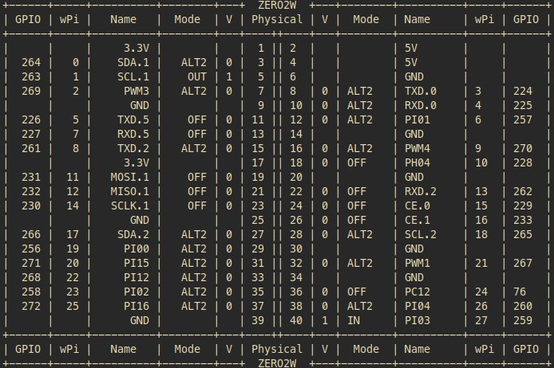

<p align="center">

</p>

\* _This page is a 4 minute read._

\*\* _I will be using the **Orange Pi Zero 2W** for the purposes of this guide._

# Accompanying YouTube Video

Faster to just read the `README`, but [here](https://youtu.be/UN8T_Bn4E-o).

# Purpose

I felt that the Debian image for the Orange Pi Zero 2W was a bit _wonky_, so I thought a pure Armbian image might be worth looking into.

# Target Boards

These instructions will work _without adjustment_ for many Orange Pi boards. This applies more to the wiringOP side of things (necessary for GPIO to work), as opposed to Armbian (which is easy to get up and running).

Should work on ✅:

- Orange Pi Zero 2W
- Orange Pi 5 Plus
- Orange Pi Zero 3

Known to not work ❌:

- Orange Pi PC Plus

# Orange Pi Zero 2W Armbian Setup

1. Download your preferred image from [Armbian](https://www.armbian.com/orange-pi-zero-2w/).
2. Burn the image onto a microSD card using something like [USBImager](https://bztsrc.gitlab.io/usbimager/).

## Wireless Setup

📝 _For those who are **not** going [headless](https://en.wikipedia.org/wiki/Headless_computer), you have the option of skipping steps 1 and 2._

I will be doing a `headless` setup, so I need the Wifi to connect automatically on boot. Armbian lets you `PRESET` certain things, you can find the full list [here](https://github.com/armbian/build/blob/66b0171516297ced0b0fead62c2f2763627176e5/extensions/preset-firstrun.sh). I'll be setting up the Wifi, and making other adjustments as well (you don't need to though).

1. On your previously imaged microSD card, edit the file `/root/.not_logged_in_yet`. 📝 In linux, you will need `root` privileges to edit this file.
2. These are the file contents. You **must** adjust to your needs:

```bash
# Required
PRESET_NET_CHANGE_DEFAULTS=1

# If both WIFI and ETHERNET are enabled, WiFi will take priority and Ethernet will be disabled.
PRESET_NET_WIFI_ENABLED=1
# Just as an example
PRESET_NET_ETHERNET_ENABLED=1
PRESET_NET_WIFI_SSID='Wifi network name'
PRESET_NET_WIFI_KEY='Wifi password'
# https://en.wikipedia.org/wiki/List_of_ISO_3166_country_codes
PRESET_NET_WIFI_COUNTRYCODE='CA'
# Yes, the following is correct, if you want Wifi to connect automatically
PRESET_CONNECT_WIRELESS=n

# Optional
SET_LANG_BASED_ON_LOCATION=n
# Do not change en_US.UTF-8, or it will lead to an error with user creation
PRESET_LOCALE=en_US.UTF-8
# Type `timedatectl list-timezones` in a linux terminal
PRESET_TIMEZONE=America/Toronto
# Armbian default root password is 1234
PRESET_ROOT_PASSWORD=tester123
# Adds a new user to the `sudo` group
PRESET_USER_NAME=opi
PRESET_USER_PASSWORD=tester123
PRESET_DEFAULT_REALNAME=OrangePi
```

3. Boot the device with the microSD card (first boot takes longer).
4. `SSH` into the device: `ssh root@ip.address`.
5. Do a full update and reboot.

```shell
sudo apt update && sudo apt full-upgrade --yes
sudo reboot now
```

## GPIO

To be able to use the GPIO pins, certain packages must be installed.

### wiringOP

📝 You can find installation instructions for your particular Orange Pi board on the [Orange Pi Wiki](http://www.orangepi.org/orangepiwiki/index.php/Main_Page).

<!-- You can find an _incomplete_ list on the official [wiringOP](https://github.com/orangepi-xunlong/wiringOP) repo. -->

Original instructions [source](http://www.orangepi.org/orangepiwiki/index.php/Orange_Pi_Zero_2W#How_to_install_wiringOP).

#### Clone the Repo

```shell
cd ~
sudo apt update && sudo apt install git
git clone https://github.com/orangepi-xunlong/wiringOP.git -b next
```

#### Compile and install wiringOP

```shell
cd ~/wiringOP
sudo ./build clean
sudo ./build
```

#### Test the installation

```shell
gpio readall
```

##### Expected output



\* _Will vary depending on your device_

### wiringOP-Python

Original instructions [source](http://www.orangepi.org/orangepiwiki/index.php/Orange_Pi_Zero_2W#How_to_install_wiringOP).

#### Install Packages

```shell
sudo apt install swig python3-dev python3-setuptools
```

#### Ready the Repo

```shell
cd ~
git clone --recursive https://github.com/orangepi-xunlong/wiringOP-Python -b next
cd wiringOP-Python
git submodule update --init --remote
```

#### Compile and Install

```shell
python3 generate-bindings.py > bindings.i
sudo python3 setup.py install
```

#### Test the Installation

```shell
 python3 -c "import wiringpi; help(wiringpi)"
```

##### Expected output

```Python
Help on module wiringpi:

NAME
    wiringpi

DESCRIPTION
    # This file was automatically generated by SWIG (https://www.swig.org).
    # Version 4.1.0
...
```

🎉 If you've made it this far with the `expected outputs`, your Orange Pi is good to go! 🎉

Please star ⭐ the repo!

# Useful Armbian Utils

- `armbian-config`
  - You can use this to configure your device.
- `armbianmonitor`
  - This is particularly useful if you want to see CPU speed, temperatures, etc.

# Sources

- [Armbian](https://www.armbian.com/orange-pi-zero-2w/)
- [Orange Pi Zero 2W Wiki](http://www.orangepi.org/orangepiwiki/index.php/Orange_Pi_Zero_2W)
- [wiringOP](https://github.com/orangepi-xunlong/wiringOP)
- [wiringOP-Python](https://github.com/orangepi-xunlong/wiringOP-Python)

<!-- # Useful Aliases

These are specific to the Orange Pi Zero 2W. Please adjust for your device.

```bash
# Live view of CPU core temperatures
alias wtemp='watch -n 1 "cat /sys/class/thermal/thermal_zone0/temp && cat /sys/class/thermal/thermal_zone1/temp && cat /sys/class/thermal/thermal_zone2/temp && cat /sys/class/thermal/thermal_zone3/temp"'

# Live view of CPU speed
alias wspeed='watch -n 1 "cat /sys/devices/system/cpu/cpufreq/policy0/scaling_cur_freq"'

# Live view of CPU speed and temperatures
alias wboard='watch -n 1 '\''echo "CPU Freq: $(cat /sys/devices/system/cpu/cpufreq/policy0/scaling_cur_freq)"; echo "CPU0: $(cat /sys/class/thermal/thermal_zone0/temp)"; echo "CPU1: $(cat /sys/class/thermal/thermal_zone1/temp)"; echo "CPU2: $(cat /sys/class/thermal/thermal_zone2/temp)"; echo "CPU3: $(cat /sys/class/thermal/thermal_zone3/temp)"'\'
``` -->
